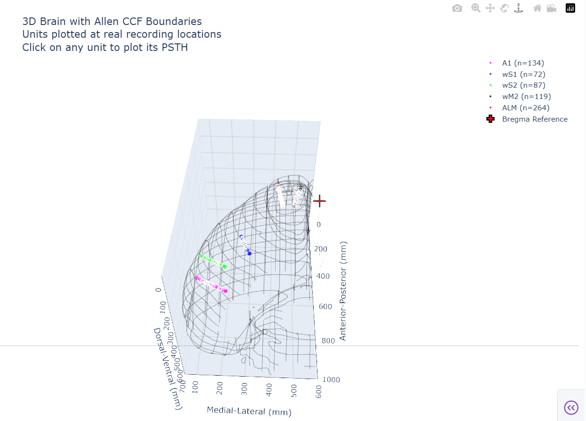

<p align="center">
  
</p>

# 🧠 Ephys Data Viewer

🧠 **Ephys Data Viewer** is a lightweight, interactive tool built in Dash for exploring and visualizing neural activity datasets in **NWB format**.  
Designed specifically for data related to  	👉 **"Contextual gating of whisker-evoked responses by frontal cortex supports flexible decision making"** (2025).
It supports brain-region-specific plots, trial-wise interaction, and flexible region mapping. 


[](https://www.python.org/downloads/)
[](https://dash.plotly.com/)
[](https://www.nwb.org/)
[](LICENSE)

## ✨ Features

### 🎯 **Interactive 3D Brain Visualization**
- **Real CCF Coordinates**: Units plotted at actual recording locations using Allen CCF coordinates
- **Allen Brain Atlas Integration**: Background mesh from Allen Mouse Brain CCF
- **Activity-Based Coloring**: Color-code units by firing rate in custom time windows
- **Interactive Unit Selection**: Click on any unit to automatically plot its PSTH

### 📊 **Advanced PSTH Analysis**
- **Multi-Region Analysis**: Compare neural responses across brain regions
- **Single Unit Analysis**: Detailed analysis of individual neurons
- **Behavioral Correlation**: Align neural activity with behavioral signals
- **Trial Filtering**: Filter trials by lick behavior, trial type, and early lick events

### 🎮 **Behavioral Signal Processing**
- **Movement Tracking**: Whisker angle, jaw movement, tongue movement
- **Signal Processing**:  filtering, speed calculations
- **Real-time Alignment**: Behavioral signals aligned to neural events

### 🎨 **Modern Web Interface**
- **Responsive Design**: Works on desktop and tablet
- **Real-time Updates**: Instant visualization updates
- **Professional UI**: Clean, research-grade interface
- **Export Ready**: High-quality plots

## 🚀 Quick Start

### Prerequisites
- Python 3.8 or higher
- NWB data files from your recording sessions

### Installation

1. **Clone the repository**
   ```bash
   git clone https://github.com/parviz-gh/nwb-data-viewer.git
   cd nwb-data-viewer
   ```

2. **Install dependencies**
   ```bash
   pip install -r requirements.txt
   ```

3. **Configure your data path**
   Edit `nwb_data_viewer.py` line 46:
   ```python
   NWB_DIR = r'path/to/your/nwb/files'  # Update this path
   ```

4. **Run the application**
   ```bash
   python nwb_data_viewer.py
   ```

5. **Open your browser**
   Navigate to `http://localhost:8050`

## 📁 Data Requirements

Your NWB files should contain:
- **Units table** with spike times and brain region locations
- **Trials table** with event timestamps
- **Behavioral data** in processing modules
- **CCF coordinates** for 3D visualization (optional)

### Example NWB Structure
```
nwbfile/
├── units/
│   ├── spike_times
│   ├── location (brain region)
│   └── ccf_xyz (coordinates)
├── trials/
│   ├── start_time
│   ├── lick_flag
│   ├── trial_type
│   └── early_lick
└── processing/
    └── behavior/
        ├── BehavioralTimeSeries/
        │   ├── C2Whisker_Angle
        │   ├── Jaw_Coordinate
        │   └── Piezo_lick_trace
        └── BehavioralEvents/
```

## 🎯 Usage Guide

### 1. **Load Your Data**
- Select an NWB file from the dropdown
- View session metadata and trial information

### 2. **Choose Analysis Mode**
- **Single Unit**: Analyze individual neurons
- **By Brain Region**: Compare responses across regions

### 3. **Configure PSTH Analysis**
- Select event field for alignment
- Choose behavioral signal for correlation
- Apply trial filters if needed

### 4. **Explore 3D Brain**
- Switch between region colors and activity-based coloring
- Set custom activity time windows
- Click on units to automatically plot PSTH

### 5. **Interpret Results**
- Neural PSTH shows firing rate changes
- Behavioral PSTH shows movement patterns
- 3D brain shows spatial organization

## 🔬 Research Context

This tool was developed for analyzing neural data from **whisker-evoked responses in frontal cortex** during decision-making tasks. Key features support:

- **Contextual Gating**: Compare responses across different trial contexts
- **Frontal Cortex Analysis**: Focus on ALM, wM2, and other frontal regions
- **Whisker-Behavior Correlation**: Link neural activity to whisker movements
- **Decision-Making Dynamics**: Track neural responses during choice behavior

## 🛠️ Technical Details

### Architecture
- **Frontend**: Dash (Plotly) for interactive web interface
- **Backend**: Python with PyNWB for data handling
- **Visualization**: Plotly 3D for brain plots, 2D for PSTH
- **Data Processing**: NumPy, SciPy for signal processing

### Key Components
- **AllenSDK Integration**: For brain atlas and CCF coordinates
- **Signal Processing**: Savitzky-Golay filtering, speed calculations
- **Statistical Analysis**: PSTH calculation with SEM
- **Interactive Features**: Real-time filtering and selection

## 📊 Screenshots

### Main Interface
<div align="center">
  
</div>


### 3D Brain Visualization
<div align="center">
  
</div>

 
### PSTH Analysis
<div align="center">
  
</div>


## 🎥 Demo Video

[](https://youtu.be/2OcJNpaLaDM)

*Click to watch the full demonstration*

## 📚 Publications

This tool was developed for:
> **"Contextual gating of whisker-evoked responses by frontal cortex supports flexible decision making"**
> 
> Parviz Ghaderi, Sylvain Crochet, and Carl Petersen
> 
> * 2025*

## 🤝 Contributing

We welcome contributions! Please:

1. Fork the repository
2. Create a feature branch
3. Make your changes
4. Add tests if applicable
5. Submit a pull request

## 📄 License

This project is licensed under the MIT License - see the [LICENSE](LICENSE) file for details.

## 🙏 Acknowledgments

- **Allen Institute**: For brain atlas and CCF coordinates
- **NWB Community**: For the data format standard
- **Prof. Carl petersen and Dr. Sylvain Crochet**: For research support

## 📞 Contact

- **Author**: Parviz Ghaderi
- **Email**: parviz.ghaderi@epfl.ch
- **Lab**: LSENS, Brain Mind Institute, EPFL
- **GitHub**: [@parviz-gh](https://github.com/parviz-gh)

---

<div align="center" style="display: flex; align-items: center; justify-content: center; gap: 20px;">

<span style="font-size: 18px; font-weight: bold;">
  Made with ❤️ for neuroscience research
</span>


</div>


